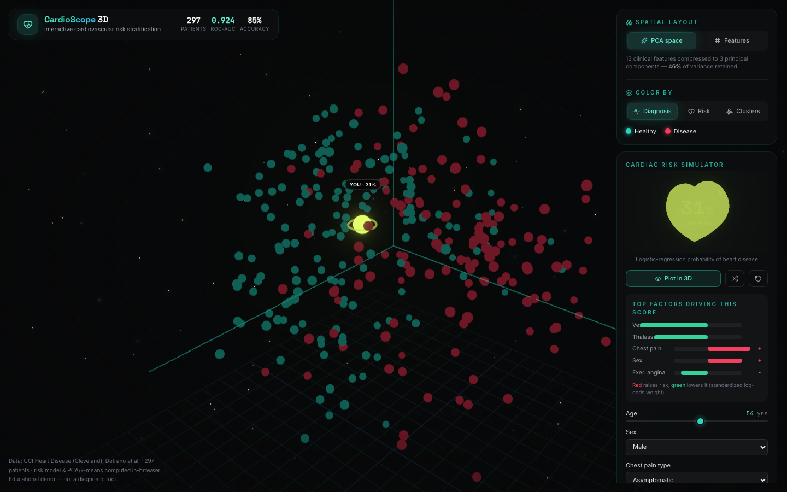

# CardioScope 3D — Cardiovascular Risk Explorer

An interactive **3D data-analytics application** that turns a real clinical dataset into an explorable space. Every one of the 297 patients in the UCI Heart Disease (Cleveland) cohort is rendered as a point in 3D; you can re-project the cloud, cluster it, color it by model risk, and drop your own simulated patient into the same space to see where they land.

Built to demonstrate the full data-science loop — **ingestion → dimensionality reduction → unsupervised clustering → a predictive model → a real-time, explainable interface** — not just a chart.

**▶ Live demo: [cardioscope-3d.vercel.app](https://cardioscope-3d.vercel.app)**



---

## What it does

| Feature | What's happening under the hood |
|---|---|
| **3D patient cloud** | All 297 patients plotted as a live, orbitable point cloud with bloom-lit rendering. Hover or use ←/→ to inspect any patient. |
| **PCA projection** | 13 clinical features (18 standardized columns after one-hot encoding) compressed to 3 principal components (≈37% of variance) for the default spatial layout. |
| **Custom feature axes** | Swap any of the 13 features onto the X/Y/Z axes, with labelled ticks; discrete features are jittered so stacked patients stay visible. |
| **k-means clustering** | Unsupervised k-means (k = 2–6) on standardized features — *diagnosis labels are never used*. A per-cluster disease-rate table, purity and adjusted Rand index show how well the clusters line up with true diagnosis (k = 2: 81% purity). |
| **Risk model** | A logistic-regression classifier (trained in-repo) scores any patient's probability of heart disease. **Stratified 10-fold cross-validated ROC-AUC 0.906, accuracy 83.8%** (training-set fit: 0.934 / 87.5%). |
| **Cardiac risk simulator** | Adjust 13 inputs and watch a 3D heart beat faster and change color as risk rises, with the live probability and an explainable breakdown of each feature's log-odds contribution versus the average patient. |
| **Plot yourself in 3D** | Your simulated patient is projected into the same PCA/feature space and linked to the 5 most similar real patients — with how many of them actually had disease. |
| **Load a real patient** | Shuffle loads a random cohort patient and shows their true diagnosis next to the model's prediction. |
| **Model card** | Cross-validated ROC curve, calibration plot, confusion matrix, every coefficient, and the model's caveats. |
| **Shareable links** | The view and simulator inputs live in the URL hash — copy the address bar to share an exact state. |

## The data

- **Source:** [UCI Heart Disease Data Set](https://archive.ics.uci.edu/dataset/45/heart+disease) (Cleveland), Detrano et al.
- **Cohort:** 303 patients → 297 after dropping 6 rows with missing vessel/thalassemia values (standard practice for this dataset).
- **Target:** binarized to *disease present* (angiographic narrowing > 50%) vs. *healthy*.
- All preprocessing and model fitting are reproducible via [`scripts/process-data.mjs`](scripts/process-data.mjs), which emits the typed data module the app consumes.

> ⚕️ **Disclaimer:** This is an educational data-visualization demo, *not* a diagnostic tool.

## Methods

- **Encoding** — the nominal features (chest-pain type, resting ECG, ST slope, thalassemia) are one-hot encoded against a reference level, so the model never assumes an order between their codes (disease rates by chest-pain type are 30% / 18% / 22% / 73% — not a trend). Every design column is then z-scored with the cohort mean/σ; the same transform is applied to live simulator input so the model and projections stay consistent.
- **PCA** — computed on the standardized design matrix via `ml-pca`; scores normalized per-component to fill the scene.
- **k-means** — `ml-kmeans` on the same matrix, with k-means++ init and a fixed seed for stable, reproducible clusters.
- **Logistic regression** — batch gradient descent with L2 regularization, run to convergence (gradient < 1e-7) and fit offline so the browser model is deterministic. Coefficients are on standardized columns, so the "what drives this score" panel is a direct read of each feature's pull on the log-odds relative to the average patient.
- **Evaluation** — stratified 10-fold cross-validation with standardization refit inside each fold; the header and model card report these held-out numbers, with the (optimistic) training-set fit shown only for comparison.
- **Interpretation** — the strongest drivers (vessel count, asymptomatic chest pain, reversible thalassemia defect, sex) match the clinical literature. Two coefficients don't: age is slightly negative and high fasting blood sugar is negative. These are conditional effects in a small, referred sample (much of age's effect is carried by vessels, max heart rate and ST changes) and shouldn't be read causally.

## Tech stack

- **React 18 + TypeScript + Vite**
- **react-three-fiber / three.js / drei** — 3D scene, instanced point cloud, procedural beating-heart geometry
- **@react-three/postprocessing** — selective bloom
- **ml-pca / ml-kmeans** — in-browser analytics
- **Tailwind CSS + Framer Motion + Lucide** — HUD and motion
- **Fontsource** — self-hosted fonts (no third-party font requests)
- **Vitest + GitHub Actions** — unit tests and CI (lint, test, build)

**Accessibility & resilience:** labelled controls, keyboard inspection of the 3D cloud (←/→, Esc), a colour-blind-safer blue→amber→rose palette, `prefers-reduced-motion` support, a phone layout with a bottom sheet, and graceful fallbacks when WebGL is unavailable.

## Run locally

```bash
npm install
npm run dev          # http://localhost:5173

# regenerate data + model from the raw UCI file
curl -fsSL "https://archive.ics.uci.edu/ml/machine-learning-databases/heart-disease/processed.cleveland.data" -o /tmp/cleveland.data
node scripts/process-data.mjs /tmp/cleveland.data

npm test             # unit tests (vitest)
npm run build        # type-check + production build
npm run lint
```

## Project structure

```
src/
  data/
    patients.ts      # AUTO-GENERATED: cleaned cohort + model coefficients + metrics
    features.ts      # clinical metadata (labels, units, input specs) for all 13 features
  lib/
    analytics.ts     # encoding, risk scoring, PCA, k-means, neighbours, color/positioning helpers
    urlState.ts      # shareable URL-hash state
    hooks.ts         # media-query, reduced-motion, in-view and WebGL helpers
    *.test.ts        # vitest unit tests
  components/
    Scene.tsx        # main R3F canvas, axes + ticks, hover tooltips, neighbour links, bloom
    PatientCloud.tsx # instanced, animated 3D scatter of all patients
    UserMarker.tsx   # the pulsing "you" marker projected into the same space
    Heart.tsx        # procedural beating heart driven by live risk
    ControlPanel.tsx # layout + color-mode controls, cluster-vs-diagnosis summary
    RiskPanel.tsx    # risk simulator inputs, score, factor breakdown, nearest patients
    ModelCard.tsx    # ROC, calibration, confusion matrix, coefficients, caveats
    ErrorBoundary.tsx
    Header.tsx
scripts/
  process-data.mjs   # reproducible data cleaning + model training
```

---

Built by **Pavan Venkata Manjunath Mallipudi** — CS + Data Science, Arizona State University.
